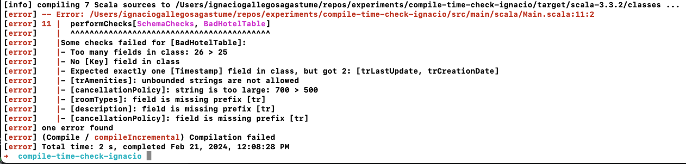

# Compile-time Schema Checks

## Credits first

This SBT project is a re-write of the repository:

https://github.com/ncreep/custom-compile-time-errors

by Daniel Beskin (ncreep at Github).

This repository only renames some objects, imports and files and make it a standalone SBT project.

The original repo (mentioned above) is the code from a _**Functional Scala 2023**_ conference talk, called
_**"Custom Compile-Time Errors with a Vengeance"**_, available on YouTube:

https://www.youtube.com/watch?v=7qeTuqrFNYc

The slides of the talk can be found also in the original repo or at this link:

https://ncreep.github.io/custom-compile-time-errors/presentation/presentation.html#1

## Introduction

This repository defines some type-level functions and the inline definition:

```scala
inline def performChecks[Checks <: Tuple, A](using caseClass: CaseClass[A]): Unit 
```

That is executed at _compile-time_.

The idea is that we have some available data types (see `data_types` object) that we can use in a case class, 
representing the schema of the table.

We can define then a case class representing a Database table like this (for example):

```scala
  case class PersonTable(
    trPersonId: Key,
    trLastUpdate: Timestamp,
    trName: SizedString[200],
    trAddress: SizedString[200],
    trCity: SizedString[100],
    trPhoneNumber: SizedString[15],
    trAge: Natural)
```

Then, by compiling (and thus executing the `performChecks` inline function), we can check that the schema follows 
certain restrictions, like the following:

```scala
type SchemaChecks =
    HasAtMostFields2[10] *: ExactlyOneOf[Key, "Key"] *: ExactlyOneOf[Timestamp, "Timestamp"] *: StringFieldsAtMost[200] *: HasPrefix["tr"] *: EmptyTuple
```

If it compiles, the table fulfills these requirements. Otherwise, the compilation will show a list of errors 
explaining why the case class failed at fulfilling the schema requirements. For example, the case class had more 
than 10 fields, or there is a string of length greater than 200. See an example of the error in the _Usage_ section.

## Format code and compile

Use the following SBT custom command:

```bash
sbt check
```

## Usage

Try compiling first the project as it is, it should compile successfully.

Then, go to the `Main.scala` file, and uncomment line 11:

```scala
import check_definitions.performChecks
import models.{BadHotelTable, HotelTable}
import schema_checks.SchemaChecks

object Main extends App {

  performChecks[SchemaChecks, HotelTable]

  // TODO: Uncomment the following line and enter "sbt check" in the console
  //  to see the compile time errors:
  //  performChecks[SchemaChecks, BadHotelTable]
}
```

If we uncomment line 11 and perform the checks for the `BadHotelTable`, you will see an error like the following:



Skim through the code and see how the `performChecks` function is defined. Watch the talk on YouTube so you get more 
background.

Then, you can copy the definitions in this project to your own project and you can make use of compile-time checks 
against your Database schema definitions using simple case classes.


